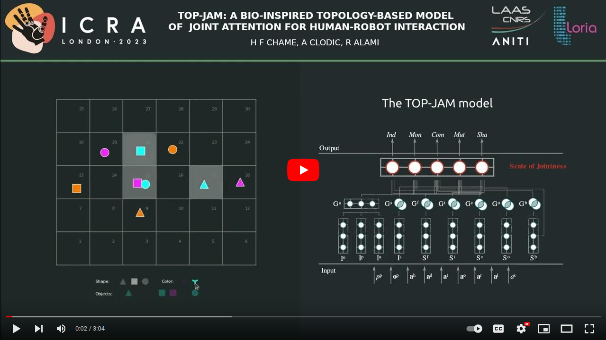
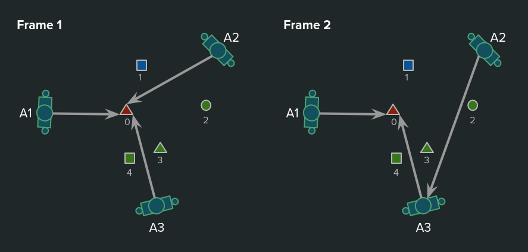

# TOP-JAM

The *topology-based model for joint attention* (TOP-JAM) is an algorithm (developed in Python 3 as a ROS package) which allows to represent and track in real-time joint attention (JA) states for several humans and robots interacting. TOP-JAM is based on the following assumptions :
 
 - The perception and representation of JA constitutes an isomorphic relation.
 - Inspiration on *dynamic neural fields* (DNF) theory is a promising way to investigate contextual and non-linear spatio-temporal relations underlying attention and knowledge sharing in HRI.

The principles behind TOP-JAM are discussed in the following paper :

- **Work reference**
	</br></br>Chame, H. F., Clodic, A., & Alami, R. (2023).</br> 
	[TOP-JAM: A bio-inspired topology-based model of joint attention for human-robot interaction](https://hal.science/hal-04023355). </br>
	*(in press) 2023 International Conference on Robotics and Automation (ICRA)*, hal-04023355.

A video presenting simulations and experiments with TOP-JAM is available here:

<a href="https://youtu.be/PAI0Iyw2OsQ" rel="TOP-JAM"></a>

## Project content

In this repository the implementation of TOP-JAM is provided. The project aimed at achieving three important objectives: a) to obtain real-time performance, b) to preserve the mathematical structure of neural network models as much as possible, and c) to comply with important software engineering principles, such as readability, maintainability, and extensibility. 


## Simulated scenario

As shown in the figure below, a simulation is proposed to illustrate how to set the parameters for the model. In the scene, the interaction of three actors is mediated by five objects. In frame 1 all three actors direct the head towards object zero (the red triangle). At time instant 5.000 ms A3 starts to change the head orientation towards A2's face, the motion is finished at time instant 6.000 ms (see the key *transition* at the bottom of file *SimulatorProvider.json*, containing a list structure where more transitions could be added).    



## The ROS packages

Four packages are implemented :

- **common_tools**

  Contains shared resources for all packages for time handling, logging, mathematical and geometric operations and functions. 

- **data_server**
 
  Implements the TOP-JAM data input interface (i.e. behavioral observations). A simulation provider is given as example (see *src/data-server/SimulatorProvider.py*). In order to implement a new data provider, the class Provider (see *src/data-serverProvider.py*) should be extended and imported in *DataServer.py*. The provider extended class name can be parameterized in the file *parameters/DataServer.json*

- **network_server**

  Implements the network models and the extended features (I&ast;, S&ast;, J&ast; and the scale of jointness) for each pair of actors. The parameters of the neural networks are set in the file *parameters/AgentServer.json*.
 
- **network_monitor**
 
  Implements the GUI for monitoring TOP-JAM estimations. By pressing the key Tab it is possible to switch the perspective among available actors.

## Requirements

The project has been successfully tested in the operative system Ubuntu 20.04 LTS with ROS Noetic Ninjemys, and the Python programming language version 3.8.10.

## Instructions for installation

- Clone the project directly in the catkin_workspace *src* folder.
- In the catkin_workspace folder run
  
```
	catkin_make install
```	
- Check that no errors are present in the log.
- Finally, run 
  
```
	rospack profile
```    

## Running TOP-JAM

  Launch orderly the following commands
  
```
	rosrun data_server data_server_service.py
	rosrun network_server network_server_service.py
	rosrun network_monitor network_server_node.py
	rosrun network_server network_server_node.py
	rosrun data_server data_server_node.py
```
## Contact

This program was implemented by Hendry Ferreira Chame.

  **Lab** LORIA-CNRS
  
  **Team** Neurorhythms
  
  **Address** Campus Scientifique, 615 Rue du Jardin-Botanique, 54506 Vandœuvre-lès-Nancy.
  
  **E-mail** hendry.ferreira-chame@loria.com

